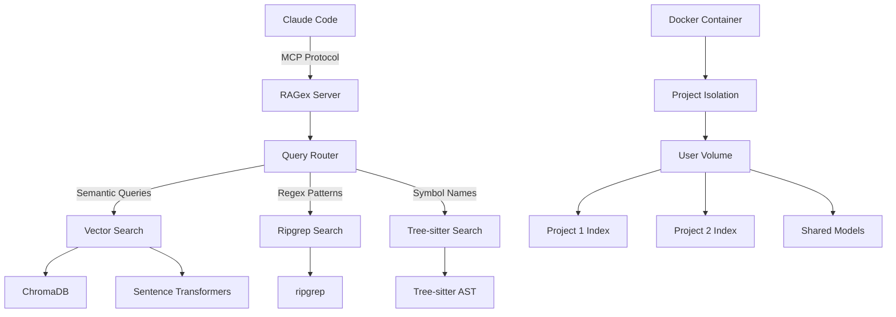
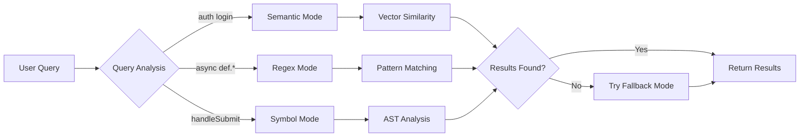

# RAGex - AI-Powered Code Search for Claude

> **Stop creating duplicate code.** Give Claude semantic search superpowers to find and reuse existing patterns in your codebase.

[](#-quick-start) [](https://github.com/jbenshetler/mcp-ragex/pkgs/container/mcp-ragex) [](https://modelcontextprotocol.io/)

<details open>
<summary><strong>TL;DR - Quick Installation & Setup</strong></summary>

**Install:**
```bash
curl -sSL https://get.ragex.dev | bash -s -- --network --model balanced
```

**Setup:**
```bash
cd your-project
ragex start                    # Index your codebase (1-5 minutes)
ragex register claude | sh     # Connect to Claude Code
```

**Test:**
```bash
ragex search "auth functions"     # Semantic search
ragex search "async def" --regex   # Pattern search
```

**What you get:** Claude Code can now semantically understand your entire codebase, find existing patterns, and reuse code instead of duplicating it. Works with both semantic search ("find authentication logic") and fast regex patterns ("async def.*test").

</details>

## Table of Contents

- [🚨 The Problem](#-the-problem)
- [✨ The Solution](#-the-solution)  
- [🚀 Quick Start](#-quick-start)
- [📹 Video Demos](#-video-demos)
- [🎯 What You Get](#-what-you-get)
- [📖 Complete Examples](#-complete-examples)
- [🔧 CLAUDE.md Setup](#-claudemd-setup)
- [📋 Installation Details](#-installation-details)
- [🚀 Advanced Usage](#-advanced-usage)
- [⚡ Performance & Architecture](#-performance--architecture)
- [🌟 Why RAGex?](#-why-ragex)
- [🤝 Contributing & Support](#-contributing--support)

## 🚨 The Problem

Claude Code can't find existing code in your project, leading to:
- ❌ **Duplicate functions** - "I'll create a new authentication system..." (when one exists)
- ❌ **Missed patterns** - Ignores your coding conventions and best practices
- ❌ **Inefficient workflow** - You resort to manual grep/search to guide Claude

## ✨ The Solution

RAGex gives Claude **semantic understanding** of your entire codebase:
- 🔍 **Semantic search** - "Find auth functions" → discovers `UserValidator`, `loginHandler`, `AuthMiddleware`
- ⚡ **Lightning fast** - Sub-second search across thousands of files using ripgrep + vector embeddings
- 🧠 **Context aware** - Understands code relationships, not just text matching
- 🛡️ **Secure & private** - Runs locally in Docker, no code leaves your machine

## Features

### 🔍 **Intelligent Search Modes**
- **Auto-detection**: Automatically chooses the best search mode based on query patterns
- **Regex mode**: Fast pattern matching with ripgrep for exact patterns
- **Semantic mode**: Natural language search using sentence-transformers embeddings

### 🚀 **Performance & Security**
- **Fast code search** using ripgrep with regex support
- **Security-first design** with input validation and path restrictions
- **File type filtering** supporting 30+ programming languages
- **Enhanced file exclusions** with multi-level .rgignore support and comprehensive defaults
- **Configurable limits** to prevent resource exhaustion
- **JSON-RPC interface** following MCP standards

### 🧠 **AI-Powered Features**
- **Semantic code search** using sentence-transformers embeddings
- **Query enhancement** with abbreviation expansion and context addition
- **Intelligent fallback** when primary search mode fails
- **Teaching system** that guides Claude Code to optimal search usage

## 🚀 Quick Start

### One-Line Install

```bash
curl -sSL https://get.ragex.dev | bash
# Alternative: curl -sSL https://raw.githubusercontent.com/jbenshetler/mcp-ragex/main/install.sh | bash
```

**What happens:**
- ✅ Auto-detects your platform (AMD64/ARM64/CUDA)
- ✅ Pulls optimized Docker image (~2-3GB)
- ✅ Installs `ragex` CLI to `~/.local/bin`
- ✅ Creates isolated user data volume

<details>
<summary>📋 Installation Options & Details</summary>

### Installation with Options
```bash
# Enable network access + better model (recommended)
curl -sSL https://get.ragex.dev | bash -s -- --network --model balanced

# Force CPU version (smaller download)
curl -sSL https://get.ragex.dev | bash -s -- --cpu --network

# Force CUDA (NVIDIA GPU)
curl -sSL https://get.ragex.dev | bash -s -- --cuda --model accurate
```

### Platform Auto-Detection
| Platform | Auto-Selected | Image Size |
|----------|---------------|------------|
| **AMD64 + NVIDIA GPU** | CUDA | ~13GB |
| **AMD64 (no GPU)** | CPU | ~3GB |
| **ARM64 (Apple Silicon)** | CPU | ~2GB |

### Security Modes
- **Default (Secure)**: No network access, only pre-bundled models
- **Network Enabled**: Can download additional models (`--network` flag)

### Embedding Models
| Model | Size | Quality | Speed | Use Case |
|-------|------|---------|-------|---------|
| **fast** | 90MB | Good | Fastest | Default, quick setup |
| **balanced** | 435MB | Better | Fast | Recommended for most users |
| **accurate** | 1.3GB | Best | Slower | Large codebases |
| **multilingual** | 435MB | Good | Fast | Multi-language projects |

### Manual Installation
If you prefer to inspect the script first:
```bash
curl -sSL https://get.ragex.dev -o install.sh
cat install.sh  # Review the script
bash install.sh --network --model balanced
```

</details>

### Your First Project
```bash
cd your-project
ragex start                    # Index codebase (1-5 minutes)
ragex register claude | sh     # Connect to Claude Code
```

### Test It Works
```bash
# Test semantic search
ragex search "auth functions"     # Finds authentication code
ragex search "error handling"     # Finds error handling patterns
ragex search "database queries"   # Finds DB-related code

# Test regex search  
ragex search "async def" --regex   # Find async functions
ragex search "TODO|FIXME" --regex  # Find code comments
```

## 📹 Video Demos

<!-- Asciinema/term-svg capture placeholders - coming soon -->

### 🚀 Installation Demo
[](https://github.com/jbenshetler/mcp-ragex)
*One-line installation with platform auto-detection*

### ⚙️ Setup & Indexing
[](https://github.com/jbenshetler/mcp-ragex)
*Project indexing, semantic search examples, and CLI usage*

### 💻 CLI Usage Examples  
[](https://github.com/jbenshetler/mcp-ragex)
*Semantic search, regex patterns, project management commands*

### 🤖 Claude Code Integration
[](https://github.com/jbenshetler/mcp-ragex)
*Real development workflow: using RAGex within Claude Code sessions*

> **Note**: Video demonstrations will be added soon using asciinema/term-svg captures showing real-world usage scenarios.

## 🎯 What You Get

### Before RAGex
```
You: "Add user authentication to this Express app"
Claude: "I'll create a comprehensive authentication system..."
        [Creates 200 lines of new auth code]
        [Duplicates existing middleware patterns]
        [Ignores your error handling conventions]
```

### After RAGex
```
You: "Add user authentication to this Express app"
Claude: "I found your existing auth middleware at middleware/auth.js:15
         and your user model at models/User.js:8. Let me extend these
         patterns to add the authentication you need..."
        [Reuses existing patterns]
        [Follows your conventions]
        [Builds on your architecture]
```

### Semantic Search Magic

| Your Query | RAGex Finds | Why It's Smart |
|------------|-------------|----------------|
| `"auth functions"` | `validateToken()`, `loginUser()`, `AuthMiddleware` | Understands authentication concepts |
| `"database queries"` | `getUserById()`, `saveToRedis()`, `queryBuilder` | Recognizes data access patterns |
| `"error handling"` | `try/catch blocks`, `errorMiddleware`, `logError()` | Groups error-related code |
| `"file upload"` | `multer config`, `uploadToS3()`, `validateFile()` | Connects upload-related logic |

## 📖 Complete Examples

### Project Isolation
Each project gets its own semantic index:

```bash
# Work project with accurate model
cd ~/work/api-server
ragex start --model accurate
# → Creates: ragex_1000_a1b2c3d4ef567890

# Personal project with fast model  
cd ~/personal/blog
ragex start --model fast
# → Creates: ragex_1000_f9e8d7c6b5a43210

ragex ls -l
# PROJECT          ID                         MODEL     INDEXED   PATH
# api-server       ragex_1000_a1b2c3d4ef567890 accurate  yes      ~/work/api-server
# blog             ragex_1000_f9e8d7c6b5a43210 fast      yes      ~/personal/blog
```

### Advanced Search Patterns

```bash
# Semantic search (natural language)
ragex search "functions that validate user input"
ragex search "code that handles file uploads"
ragex search "database connection error handling"
ragex search "JWT token verification logic"

# Regex search (exact patterns)
ragex search "async def.*test" --regex    # Async test functions
ragex search "app\.get\(.*api" --regex      # Express API routes
ragex search "interface.*Props" --regex    # TypeScript interfaces

# Search with limits and JSON output
ragex search "auth" --limit 10 --json     # Top 10 results as JSON
```

### Project Management

```bash
# List and inspect projects
ragex ls                         # Show all your projects
ragex ls -l                      # Detailed view with models/status
ragex ls "api-*"                 # Filter projects by pattern
ragex info                       # Current project details

# Clean up old projects
ragex rm "old-project-*"         # Remove projects matching pattern
ragex rm ragex_1000_abc123       # Remove by specific ID

# Configuration
ragex configure                  # Show current config
ragex configure --cpu            # Switch to CPU mode
ragex configure --cuda           # Switch to CUDA mode
```

## 🔧 CLAUDE.md Setup

Add this to your project's `CLAUDE.md` file to optimize Claude Code's search behavior:

```markdown
# Code Search Guidelines

**IMPORTANT: This project has RAGex MCP enabled for intelligent code search.**

## Search Strategy (Priority Order)

1. **FIRST: Use RAGex MCP tools** - Semantic understanding of your codebase
   - `search_code()` with semantic mode for concepts: "auth functions", "error handling"
   - `search_code()` with regex mode for patterns: "async def.*test", "TODO|FIXME"
   - `search_code_simple()` for quick searches with auto-detection

2. **FALLBACK: Use built-in search tools** - Only if RAGex fails or is unavailable
   - `Grep` for text patterns
   - `Glob` for file discovery

## RAGex Search Modes

RAGex automatically detects the best search mode:

- **Semantic Mode**: Natural language queries
  - `"functions that handle user authentication"`
  - `"error handling for database connections"`
  - `"code that validates JWT tokens"`

- **Regex Mode**: Pattern matching (use `--regex` or detected automatically)
  - `"async def.*test"` → finds async test functions
  - `"app\.get\(.*api"` → finds Express API routes
  - `"interface.*Props"` → finds TypeScript interfaces

- **Symbol Mode**: Exact names (detected automatically)
  - `"UserService"` → finds UserService class
  - `"validateInput"` → finds validateInput function

## Effective Query Examples

```bash
# Semantic search (recommended)
search_code("user authentication and session management")
search_code("database connection error handling")
search_code("file upload processing logic")
search_code("JWT token validation functions")

# Regex patterns for exact matching
search_code("async def.*test", mode="regex")
search_code("TODO|FIXME", mode="regex")
search_code("interface.*Props", mode="regex")

# Simple interface (auto-detects everything)
search_code_simple("auth middleware")
search_code_simple("error handlers")
```

## When RAGex Finds Existing Code

1. **ANALYZE** the patterns before writing new code
2. **EXTEND** existing functions rather than duplicating logic
3. **FOLLOW** established architecture and naming conventions
4. **REUSE** utility functions, middleware, and helpers
5. **UNDERSTAND** the codebase structure and relationships

## Search Tips

- Be specific with domain terms: "JWT", "middleware", "validation", "serialization"
- Use natural language for concepts, patterns for exact matches
- RAGex understands code relationships, not just text matching
- Results include file paths and line numbers for easy navigation
- Try different phrasings if first search doesn't find what you need

## Benefits

- **Faster development**: Reuse existing patterns instead of recreating
- **Consistent architecture**: Follow established project conventions
- **Better code discovery**: Find forgotten utilities and helpers
- **Reduced duplication**: Stop reinventing the wheel
```

**Why this helps:**
- Prioritizes RAGex MCP tools over built-in search
- Provides concrete examples for different search modes
- Guides Claude toward code reuse and architectural consistency
- Sets clear expectations for search capabilities and workflow

## 📋 Installation Details

<details>
<summary>Click to expand full installation guide from doc/installation-guide.md</summary>

### Quick Start (One-Line Installation)

#### Basic Installation (Auto-Detection)
```bash
curl -fsSL https://raw.githubusercontent.com/jbenshetler/mcp-ragex/refs/heads/main/install.sh | bash
```

This will:
- Auto-detect your platform (AMD64, ARM64, or CUDA)
- Install with secure defaults (no network access for containers)
- Use the pre-bundled fast embedding model

#### Installation with Options
```bash
# Install with network access enabled and balanced model as default
curl -fsSL https://raw.githubusercontent.com/jbenshetler/mcp-ragex/refs/heads/main/install.sh | bash -s -- --network --model balanced

# Force CPU version (smaller image) with network access
curl -fsSL https://raw.githubusercontent.com/jbenshetler/mcp-ragex/refs/heads/main/install.sh | bash -s -- --cpu --network --model accurate

# Force CUDA version (requires NVIDIA GPU)
curl -fsSL https://raw.githubusercontent.com/jbenshetler/mcp-ragex/refs/heads/main/install.sh | bash -s -- --cuda --model balanced
```

### Installation Parameters

#### Platform Selection
- **Auto-detection** (default): Automatically detects platform and CUDA support
- `--cpu`: Force CPU-only version (works on AMD64 and ARM64)
- `--cuda`: Force CUDA version (AMD64 only, requires NVIDIA GPU + nvidia-docker)

#### Network Configuration
- **No flag** (default): Secure mode - containers run without network access
- `--network`: Enable network access for containers (allows downloading additional models)

#### Default Embedding Model
- **No flag** (default): Uses 'fast' model (pre-bundled in all images)
- `--model <name>`: Sets default model for new projects
  - Valid options: `fast`, `balanced`, `accurate`, `multilingual`

### Docker Image Sizes

| Platform | Image Size | Use Case |
|----------|------------|----------|
| **AMD64 CPU** | ~3.2 GiB | General use, smaller download |
| **ARM64 CPU** | ~2.2 GiB | Apple Silicon Macs, ARM servers |
| **CUDA** | ~13.1 GiB | NVIDIA GPU acceleration |

### Embedding Models

| Model | Size | Speed | Quality | Use Case |
|-------|------|-------|---------|----------|
| **fast** | ~90 MB | Fastest | Good | Quick prototyping, smaller codebases |
| **balanced** | ~435 MB | Moderate | Better | Production use, balanced performance |
| **accurate** | ~1.3 GB | Slower | Best | Large codebases, maximum quality |
| **multilingual** | ~435 MB | Moderate | Good | Multi-language projects |

### Security Modes

#### Secure Mode (Default)
```bash
curl -fsSL https://raw.githubusercontent.com/jbenshetler/mcp-ragex/refs/heads/main/install.sh | bash
```
- Containers run with `--network none`
- No external network access from containers
- Only pre-bundled fast model available
- Suitable for air-gapped environments

#### Network-Enabled Mode
```bash
curl -fsSL https://raw.githubusercontent.com/jbenshetler/mcp-ragex/refs/heads/main/install.sh | bash -s -- --network
```
- Containers can access external networks
- Can download additional embedding models on demand
- Required for using balanced, accurate, or multilingual models

### Post-Installation

#### Verify Installation
```bash
ragex --help
ragex info
```

#### Quick Start
```bash
cd your-project
ragex index .          # Index current directory
ragex search "query"   # Search your code
```

#### Configuration
```bash
ragex configure        # Show current configuration
ragex ls              # List indexed projects
```

### Troubleshooting

#### Docker Not Found
```
❌ Docker not found. Please install Docker first.
```
**Solution**: Install Docker from https://docs.docker.com/get-docker/

#### Docker Daemon Not Running
```
❌ Docker daemon not running. Please start Docker.
```
**Solution**: Start Docker Desktop or run `sudo systemctl start docker`

#### Unsupported Architecture
```
❌ Unsupported architecture: s390x
```
**Solution**: RAGex currently supports AMD64 and ARM64 only

### Integration with Claude Code

After installation, register RAGex with Claude Code:

```bash
# Get the registration command
ragex register claude

# Run the output command (example):
claude mcp add ragex ~/.local/bin/ragex-mcp --scope project
```

This enables RAGex as an MCP server for Claude Code, providing intelligent code search capabilities directly in your Claude conversations.

</details>

## 🚀 Advanced Usage

### Multiple Projects
```bash
# Work on different projects simultaneously
cd ~/work/api-server && ragex start --model accurate
cd ~/personal/blog && ragex start --model fast 
cd ~/opensource/cli-tool && ragex start --model balanced

# Switch between projects automatically
ragex ls                        # See all projects
cd ~/work/api-server           # RAGex automatically uses api-server index
ragex search "authentication"   # Searches only api-server code
```

### Environment Variables
```bash
# Customize behavior
export RAGEX_EMBEDDING_MODEL=balanced    # Default model for new projects
export RAGEX_LOG_LEVEL=DEBUG             # Enable debug logging
export RAGEX_DOCKER_IMAGE=custom:tag     # Use custom Docker image

# Log rotation settings
export RAGEX_LOG_MAX_SIZE=100m           # Max log file size
export RAGEX_LOG_MAX_FILES=5             # Number of rotated logs to keep
```

### Development & Debugging
```bash
# View logs
ragex log                       # Current project logs
ragex log -f                    # Follow logs in real-time
ragex log --tail 50            # Last 50 lines

# Status and info
ragex status                    # Check daemon status
ragex info                      # Project details
ragex configure                 # Current configuration

# Development mode
ragex bash                      # Get shell inside container
RAGEX_DEBUG=1 ragex start      # Enable debug output
```

### Data Management
```bash
# Your data is isolated by user ID
docker volume ls | grep ragex_user_$(id -u)

# Project data structure:
# /data/models/                   # Shared embedding models (90MB-1.3GB)
# /data/projects/ragex_1000_*/    # Individual project indexes
#   ├── chroma_db/               # Vector database  
#   └── project_info.json        # Project metadata

# Backup a project
ragex export my-project backup.tar.gz

# Check disk usage
ragex ls -l                     # Shows index sizes

# Clean up old projects
ragex rm "test-*"               # Remove test projects
ragex rm ragex_1000_old123      # Remove specific project
```

### Uninstall
```bash
# Complete removal (WARNING: Deletes all indexed data)
# Stop all ragex containers
docker ps -a -f "name=ragex_" -q | xargs -r docker stop
docker ps -a -f "name=ragex_" -q | xargs -r docker rm

# Remove images and volumes
docker images "*ragex*" -q | xargs -r docker rmi
docker volume ls -f "name=ragex_user_" -q | xargs -r docker volume rm

# Remove binaries and config
rm -rf ~/.config/ragex ~/.local/bin/ragex ~/.local/bin/ragex-mcp

# Unregister from Claude Code
claude mcp remove ragex --scope project
```

## ⚡ Performance & Architecture

### 🔌 MCP Communication Through Docker

The MCP protocol uses stdin/stdout for communication. The `ragex` wrapper script handles this transparently:

```bash
# When Claude Code runs:
claude mcp add ragex /home/user/.local/bin/ragex

# It communicates like this:
Claude Code ←→ ragex script ←→ Docker container ←→ MCP Server
           stdin/stdout    stdin/stdout      stdin/stdout
```

**Key points:**
- The `ragex` script acts as a bridge between Claude Code and the Docker container
- For MCP server mode, Docker runs with `-i` (interactive) but NOT `-t` (no TTY)
- TTY would break JSON-RPC communication by adding terminal control codes
- The wrapper preserves stdin/stdout pipes for proper MCP protocol communication

### 🏗️ Container Structure

```
/app/                     # Application code (read-only)
├── src/                  # Source code
├── scripts/              # Utility scripts
├── requirements.txt      # Python dependencies
└── entrypoint.sh        # Container entrypoint

/data/                    # User-specific persistent data (volume)
├── models/              # Shared embedding models (400MB-1.3GB)
└── projects/            # Project-specific data
    ├── ragex_1000_abc123/  # Project 1
    │   ├── chroma_db/      # ChromaDB vector database  
    │   └── project_info.json # Project metadata
    └── ragex_1000_def456/  # Project 2
        ├── chroma_db/
        └── project_info.json

/workspace/              # Your code (volume, read-only)
└── [current project]    # Code to be indexed
```

### 🔧 Environment Variables

Docker containers support these environment variables:

```bash
# Project identification (automatically set by wrapper)
WORKSPACE_PATH=/path/to/your/project    # Workspace being indexed
PROJECT_NAME=ragex_1000_abc123          # Generated project ID

# Data directories (automatically configured)
RAGEX_PROJECT_DATA_DIR=/data/projects/ragex_1000_abc123  # Project data
RAGEX_CHROMA_PERSIST_DIR=/data/projects/ragex_1000_abc123/chroma_db  # ChromaDB
TRANSFORMERS_CACHE=/data/models         # Shared model cache
SENTENCE_TRANSFORMERS_HOME=/data/models # Sentence transformers cache

# User configuration
RAGEX_EMBEDDING_MODEL=fast              # Model preset (fast/balanced/accurate)
RAGEX_CHROMA_COLLECTION=code_embeddings # Collection name

# System configuration
RAGEX_LOG_LEVEL=INFO                    # Log level (DEBUG, INFO, WARN, ERROR) - default: INFO
LOG_LEVEL=INFO                          # Fallback log level (RAGEX_LOG_LEVEL takes precedence)
DOCKER_CONTAINER=true                   # Indicates running in container
```

### 🐳 Production Deployment

Use the production Docker Compose for deployment:

```bash
# Production setup with resource limits
docker compose -f docker-compose.prod.yml up -d

# Check status
docker compose -f docker-compose.prod.yml ps

# View logs
docker compose -f docker-compose.prod.yml logs ragex
```

## Integration

### 🖥️ Claude Code (CLI)

#### Docker Integration (Recommended)

Register the Docker-based MCP server:

```bash
cd /path/to/your/project
claude mcp add ragex /path/to/mcp-ragex/ragex --scope project
```

The `ragex` script automatically handles Docker execution and volume mounting.

#### Manual Integration

For manual/development setups:

```bash
# Option 1: Using wrapper script
claude mcp add ragex /path/to/mcp-ragex/mcp_ragex.sh --scope project

# Option 2: Direct Python command
claude mcp add ragex uv run /path/to/mcp-ragex/src/server.py --scope project
```

### 🖱️ Claude Desktop (App)

Add to your `claude_desktop_config.json`:

```json
{
  "mcpServers": {
    "ragex": {
      "command": "/path/to/mcp-ragex/ragex",
      "env": {
        "RAGEX_DATA_DIR": "/path/to/persistent/data"
      }
    }
  }
}
```

### ✅ Verifying MCP Connection

After configuration, verify the MCP server is connected:

```bash
# In Claude Code, use the /mcp command
/mcp
```

This will show the status of all configured MCP servers. You should see `ragex` in the list.

## Usage Examples

### **Example Semantic Search**
This is what happened in the CLI:
```
● Let me try a broader semantic search:

● Let me search for admin endpoints:
 ⎿  Interrupted by user

> /exit
 ⎿  (no content)

> Try the ragex semantic search again.

● Task(Search for reindex endpoints)
 ⎿  Done (8 tool uses · 79.3k tokens · 1m 32.2s)

● Based on the search results, I found the department reindexing endpoints. The main force reindex endpoint is:

 POST /admin/reindex/department in /docprocessor/workflows_api.py (line 834)

```

And this is what the Ctrl-R logs show:
```
● I'll search for the function that adds documents to OpenSearch and check the field structure, then verify all 11 documents have extracted text.

● Task(Task: Find OpenSearch indexing function

   Prompt: Search for the function that indexes documents to OpenSearch. Look for:
   1. Functions that create or update documents in OpenSearch
   2. The field names used when indexing, particularly for extracted text
   3. Index operations, PUT or POST requests to OpenSearch
   4. Document structure being sent to OpenSearch

   Use search terms like:
   - opensearch index document
   - _doc PUT POST
   - index_document
   - create_document
   - extracted_text content text)
 ⎿  Search(pattern: "index.*document|create.*document|update.*document", path: "undefined")
      ⎿  Found 55 files
         /home/jeff/clients/search/contextsearch/tests/ui/README.md
         /home/jeff/clients/search/contextsearch/tests/ocr/output_metadata.json
         /home/jeff/clients/search/contextsearch/tests/ocr/output_rmeta_fixed.json
         /home/jeff/clients/search/contextsearch/tests/needs_porting/test_workflow_implementation.py
         /home/jeff/clients/search/contextsearch/tests/obsolete/test_workflow_celery_integration.py
         /home/jeff/clients/search/contextsearch/tests/obsolete/test_workflow_integration.py
         /home/jeff/clients/search/contextsearch/tests/docprocessor/test_workflows_real_files.py
         /home/jeff/clients/search/contextsearch/tests/functional/cache/test_cache_repopulation.py
         /home/jeff/clients/search/contextsearch/tests/functional/cache/test_comprehensive_cache_validation.py
         /home/jeff/clients/search/contextsearch/tests/functional/integration/filesystem_scanner.py
         /home/jeff/clients/search/contextsearch/tests/functional/nlp/test_batch_size_one.py
         /home/jeff/clients/search/contextsearch/tests/functional/search/test_date_filtering.py
         /home/jeff/clients/search/contextsearch/tests/functional/search/test_entity_filtering.py
         /home/jeff/clients/search/contextsearch/tests/functional/search/test_force_reindexing.py
         /home/jeff/clients/search/contextsearch/samples/simulate_tasks.py
```

### 🔍 **Intelligent Search Modes**

#### Auto-Detection (Recommended)
```bash
# Claude Code automatically detects the best search mode
search_code("DatabaseConnection")              # → symbol mode
search_code("functions that handle auth")      # → semantic mode  
search_code("error.*Exception")                # → regex mode
```

#### Explicit Mode Selection
```bash
# Symbol search - when you know exact names
search_code("AuthenticationService")

# Semantic search - when you know the concept
search_code("functions that validate user input", mode="semantic")

# Regex search - when you know the pattern
search_code("handleError.*Exception", mode="regex")
```

### 🧠 **Semantic Search Examples**

```bash
# Find authentication-related code
search_code("functions that handle user authentication")

# Find error handling patterns
search_code("error handling for database connections")

# Find file processing code
search_code("code that processes uploaded files")

# Find validation logic
search_code("functions that validate user input")
```

### 📋 **Symbol Search Examples**

```bash
# Find specific classes
search_code("UserService")

# Find specific functions
search_code("validateInput")

# Find methods
search_code("submitToQueue")
```

### 🔧 **Regex Search Examples**

```bash
# Find async functions
search_code("async def", mode="regex")

# Find TODO comments
search_code("TODO|FIXME", mode="regex")

# Find error handling blocks
search_code("try.*except", mode="regex")
```

### 🛠 **Advanced Features**

#### Capability Discovery
```bash
# Check available search modes
get_search_capabilities()
```

#### Simple Search Interface
```bash
# Just search - auto-detects everything
search_code_simple("database connection error")
```

#### Raw Output Format
```bash
search_code("submit_file", format="raw")
```
Returns simple `file:line` format for programmatic use.

### 📁 **File Type and Path Filtering**

```bash
# Search only Python files
search_code("class.*User", file_types=["py"])

# Search specific directories
search_code("test_", paths=["tests", "src/tests"])

# Combine filters
search_code("async def", file_types=["py"], paths=["src"])
```

## Logging and Debugging

### Setting Log Levels

RAGex uses `RAGEX_LOG_LEVEL` to control logging verbosity. The default is `INFO`.

```bash
# Set log level before starting daemon
export RAGEX_LOG_LEVEL=DEBUG
ragex start

# Or set for a single command
RAGEX_LOG_LEVEL=DEBUG ragex start

# For very verbose debugging (generates lots of output)
RAGEX_LOG_LEVEL=TRACE ragex start
```

**Available Log Levels:**
- `TRACE`: Very detailed debugging (ignore decisions, file system operations)
- `DEBUG`: Detailed debugging info (file processing, embeddings, scores)
- `INFO`: General operation info (search queries, index progress) - **default**
- `WARN`: Warnings and potential issues only
- `ERROR`: Error messages only

**Important:** The log level is set when the daemon starts and cannot be changed without restarting:

```bash
# To change log level after daemon is running:
ragex stop
RAGEX_LOG_LEVEL=DEBUG ragex start
```

### Viewing Logs

```bash
# View daemon logs for current project
ragex log

# Follow logs in real-time
ragex log -f

# View last 50 lines
ragex log --tail 50

# View logs for specific project
ragex log project-name

# View MCP server logs (when using with Claude)
tail -f /tmp/ragex-mcp.log
```

### Log Rotation and Storage

RAGex automatically manages log file sizes through Docker's log rotation to prevent disk space issues:

**Default Log Limits:**
- **Daemon logs**: 50MB per file, 3 files maximum (150MB total)
- **Admin commands**: 10MB per file, 2 files maximum (20MB total)

**Customizing Log Rotation:**

```bash
# Set custom log rotation limits
export RAGEX_LOG_MAX_SIZE=100m      # Maximum size per log file
export RAGEX_LOG_MAX_FILES=5        # Maximum number of log files to keep

# Apply settings when starting daemon
ragex stop
ragex start

# View current log rotation settings
ragex configure
```

**Available Size Units:**
- `k` or `kb`: Kilobytes (e.g., `500k`)
- `m` or `mb`: Megabytes (e.g., `50m`) 
- `g` or `gb`: Gigabytes (e.g., `1g`)

**Log Storage Location:**
- Logs are stored inside Docker containers and managed by Docker's log driver
- Use `ragex log` to view logs (automatic log rotation is handled transparently)
- Old log files are automatically deleted when limits are exceeded

### Performance Metrics

| Operation | Speed | Notes |
|-----------|-------|-------|
| **Indexing** | ~100 symbols/sec | Intel i9-7900X, varies by project size |
| **Semantic Search** | <100ms | 1000+ symbols, cached embeddings |
| **Regex Search** | <50ms | Powered by ripgrep, sub-second for large codebases |
| **Project Switching** | Instant | Automatic workspace detection |

### Real-World Timing
- **Small projects** (1k-10k LOC): 70 seconds initial indexing
- **Medium projects** (10k-100k LOC): 130 seconds initial indexing  
- **Large projects** (100k+ LOC): 5+ minutes initial indexing
- **Subsequent searches**: Sub-second response times

### Docker Resource Usage

| Component | Memory | CPU | Storage |
|-----------|--------|-----|----------|
| **Base container** | ~100MB | Low | ~3-13GB (varies by image) |
| **During indexing** | ~500MB peak | High | Temporary spike |
| **During search** | ~300MB | Low | Persistent |
| **ChromaDB index** | ~50MB | N/A | ~1MB per 1000 symbols |

### Security & Privacy

🔒 **Enterprise-Ready Security:**
- ✅ **Air-gapped mode** - No network access required (secure default)
- ✅ **Local processing** - Code never leaves your machine
- ✅ **Input validation** - All queries sanitized and validated
- ✅ **Path restrictions** - Searches confined to project directories
- ✅ **Resource limits** - Protection against resource exhaustion
- ✅ **No shell execution** - Direct subprocess calls only

### Architecture Overview



**Key Components:**
- 🧠 **Vector Search**: Semantic understanding via sentence-transformers + ChromaDB
- ⚡ **Regex Search**: Lightning-fast pattern matching with ripgrep
- 🌳 **AST Parsing**: Code structure analysis with Tree-sitter
- 🐳 **Docker Isolation**: Secure, reproducible environment per user
- 📁 **Project Separation**: SHA256-based unique project identification

### Search Intelligence



**Smart Features:**
1. 🎯 **Auto-detection** - Analyzes query patterns to choose optimal search mode
2. 🔄 **Intelligent fallback** - Tries alternative modes if primary search fails
3. 📊 **Result ranking** - Semantic relevance scoring for better matches
4. 💡 **Query enhancement** - Expands abbreviations and adds context
5. 🎓 **Learning system** - Guides Claude Code to optimal usage patterns

### Supported Languages

| Feature | Supported Languages |
|---------|--------------------|
| **Regex Search** | All file types (universal) |
| **Semantic Search** | Python, JavaScript, TypeScript, JSX, TSX, C/C++, HTML, CSS |
| **Symbol Extraction** | Python, JavaScript, TypeScript (Tree-sitter AST parsing) |
| **Planned Support** | Go, Rust, Java, C#, PHP, Ruby |

### File Type Detection
- **Automatic**: Based on file extensions
- **Configurable**: Via `.rgignore` patterns
- **Smart Exclusions**: Skips binaries, generated files, dependencies

### Smart File Exclusions

**🎯 Comprehensive Defaults** (automatically applied):
```rgignore
# Dependencies
node_modules/, .venv/, __pycache__/, vendor/

# Build artifacts  
build/, dist/, target/, .next/, .nuxt/

# IDE files
.vscode/, .idea/, *.swp, .DS_Store

# Logs and temp
*.log, .tmp/, .cache/

# Media files
*.jpg, *.png, *.mp4, *.zip, *.pdf
```

**⚙️ Customizable per Project**:
- Uses standard `.rgignore` syntax
- Multi-level support (project/directory/subdirectory)
- Respects existing `.rgignore` files
- `ragex init` creates comprehensive `.rgignore` template

## 🌟 Why RAGex?

### The RAGex Advantage

| Traditional Tools | RAGex |
|------------------|--------|
| 😫 Text-only search | 🧠 **Semantic understanding** |
| 📝 Manual copy-paste workflow | 🔄 **Intelligent code reuse** |
| 🐌 Grep through everything | ⚡ **Vector-powered speed** |
| 🔍 Find exact matches only | 🎯 **Conceptual similarity** |
| 😰 "Did I check all files?" | ✅ **Comprehensive indexing** |
| 🚫 Works against Claude | 🤝 **Enhances Claude's abilities** |

### Success Stories

**Before RAGex:**
> "Claude, add authentication to this Express app"
> → Creates duplicate middleware (200+ lines)
> → Ignores existing user models  
> → Breaks established patterns

**After RAGex:**
> "Claude, add authentication to this Express app"
> → Finds existing `auth.middleware.js:15`
> → Extends current `User` model  
> → Follows project conventions
> → 90% less code, 100% more consistency

### Enterprise Benefits
- 📈 **Faster development** - Reuse > Rewrite
- 🎯 **Consistent patterns** - Claude follows your architecture
- 🔍 **Better code discovery** - Find forgotten utilities and helpers
- 🧹 **Reduced duplication** - Stop reinventing the wheel
- 📚 **Knowledge preservation** - Your codebase becomes searchable documentation

## 🤝 Contributing & Support

### Getting Help
- 📖 **Documentation**: [Full docs](https://github.com/jbenshetler/mcp-ragex/tree/main/doc)
- 🐛 **Issues**: [GitHub Issues](https://github.com/jbenshetler/mcp-ragex/issues)
- 💬 **Discussions**: [GitHub Discussions](https://github.com/jbenshetler/mcp-ragex/discussions)
- 📧 **Support**: [support@ragex.dev](mailto:support@ragex.dev)

### Development
```bash
# Get the code
git clone https://github.com/jbenshetler/mcp-ragex.git
cd mcp-ragex

# Local development setup
make install-cpu && ragex start

# Run tests
uv run tests/test_server.py
pytest tests/

# Build documentation
make docs
```

### Roadmap
- 🚀 **Multi-language support** - Go, Rust, Java, C#
- 🔍 **Hybrid search** - Combine semantic + keyword results
- 📱 **IDE extensions** - VS Code, JetBrains, Vim
- 🌐 **Cloud deployment** - Kubernetes, AWS, GCP
- 🧠 **Custom embeddings** - Fine-tune models for your domain

---

**⭐ Star us on GitHub** | **🐳 [Docker Hub](https://hub.docker.com/r/ragex/mcp-server)** | **📦 [GitHub Packages](https://github.com/jbenshetler/mcp-ragex/pkgs/container/mcp-ragex)**

*Made with ❤️ for developers who believe in smart code reuse*


