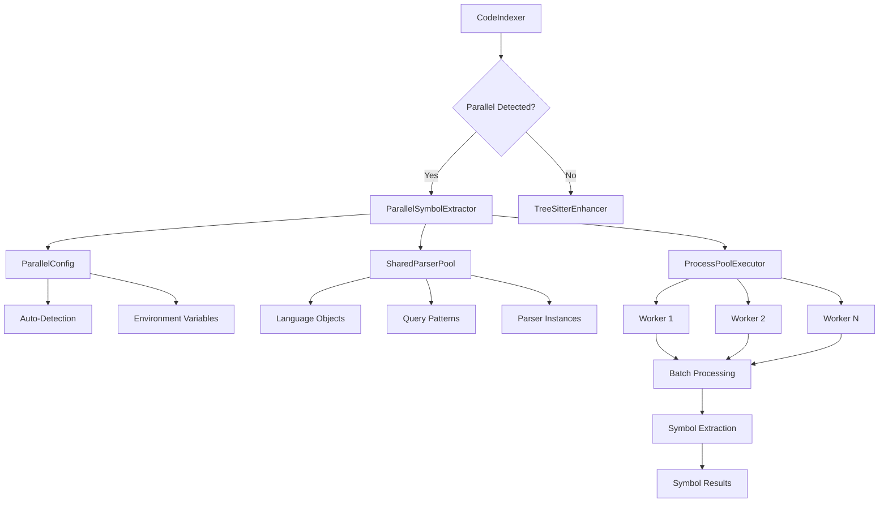

# Parallel Processing Design in RAGex

This document provides an in-depth technical design overview of the parallel symbol extraction system implemented in RAGex.

## Design Goals

### Primary Objectives

1. **Performance**: Achieve 4-8x speedup on multi-core systems
2. **Scalability**: Handle codebases with 1000+ files efficiently  
3. **Reliability**: Maintain stability with error isolation
4. **Compatibility**: Seamless integration with existing RAGex workflows
5. **Resource Efficiency**: Optimal memory and CPU utilization

### Non-Functional Requirements

- **Memory Usage**: <200MB per worker process
- **Startup Overhead**: <2 seconds initialization
- **Error Recovery**: Graceful degradation to sequential processing
- **Resource Limits**: Respect system and container constraints
- **Cross-Platform**: Work on Linux, macOS, Windows, and Docker

## System Architecture

### High-Level Overview

```
┌─────────────────────────────────────────────────────────────┐
│                    CodeIndexer                              │
│                                                             │
│  ┌─────────────────┐         ┌─────────────────────────────┐ │
│  │   Detection     │ ──────▶ │   ParallelSymbolExtractor   │ │
│  │   & Fallback    │         │                             │ │
│  │   Logic         │         │                             │ │
│  └─────────────────┘         └─────────────────────────────┘ │
│           │                                 │                 │
│           │                                 ▼                 │
│           │                  ┌─────────────────────────────┐  │
│           │                  │     ProcessPoolExecutor     │  │
│           │                  │                             │  │
│           │                  │  ┌─────┐  ┌─────┐  ┌─────┐  │  │
│           │                  │  │ W1  │  │ W2  │  │ W3  │  │  │
│           │                  │  └─────┘  └─────┘  └─────┘  │  │
│           │                  └─────────────────────────────┘  │
│           │                                 │                 │
│           ▼                                 ▼                 │
│  ┌─────────────────┐         ┌─────────────────────────────┐  │
│  │  TreeSitter     │         │     BatchProcessor          │  │
│  │  Enhancer       │         │     • File Grouping         │  │
│  │  (Sequential)   │         │     • Load Balancing        │  │
│  └─────────────────┘         │     • Progress Tracking     │  │
│                               └─────────────────────────────┘  │
└─────────────────────────────────────────────────────────────┘
```

### Component Relationships



## Core Components

### 1. ParallelSymbolExtractor

**Location**: `src/parallel_symbol_extractor.py`

**Responsibilities**:
- Orchestrates parallel processing workflow
- Manages process pool lifecycle
- Implements batching strategy
- Handles progress tracking and error recovery

**Key Classes**:

```python
@dataclass
class ExtractionTask:
    file_path: str
    include_docs_and_comments: bool
    file_size: int = 0
    language: Optional[str] = None

@dataclass  
class ExtractionResult:
    file_path: str
    symbols: List[Dict[str, Any]]
    success: bool
    error: Optional[str] = None
    processing_time: float = 0.0

class ParallelSymbolExtractor:
    def __init__(self, config: Optional[ParallelConfig] = None)
    async def extract_symbols_parallel(self, file_paths: List[str]) -> List[ExtractionResult]
    async def extract_symbols_from_files(self, file_paths: List[str]) -> List[Symbol]
```

### 2. SharedParserPool

**Location**: `src/shared_parser_pool.py`

**Responsibilities**:
- Manages tree-sitter language objects
- Pre-compiles query patterns
- Provides parser instances to workers
- Optimizes memory usage across processes

**Architecture**:

```python
class SharedParserPool:
    # Shared across all processes
    _languages: Dict[str, Language]
    _queries: Dict[str, Query]
    _parsers: Dict[str, Parser]
    
    # Process-local for workers
    def get_worker_pool() -> SharedParserPool
    def clone_parser(self, language: str) -> Parser
```

### 3. ParallelConfig

**Location**: `src/parallel_config.py`

**Responsibilities**:
- Auto-detects system capabilities
- Calculates optimal configuration
- Handles environment variable overrides
- Provides tuning recommendations

**Configuration Logic**:

```python
class ParallelConfigManager:
    def _detect_system_capabilities(self) -> dict
    def _calculate_optimal_workers(self, info: dict) -> int
    def _calculate_batch_sizes(self, info: dict, max_workers: int) -> tuple
    def get_optimal_config(self, file_count: Optional[int] = None) -> ParallelConfig
```

## Processing Workflow

### 1. Initialization Phase

```
1. CodeIndexer.__init__()
   ├── Try import ParallelSymbolExtractor
   ├── Check RAGEX_USE_PARALLEL environment
   ├── Get optimal configuration
   └── Initialize parallel or sequential extractor

2. ParallelSymbolExtractor.__init__()
   ├── Load ParallelConfig (auto-detect or provided)
   ├── Set worker count and batch parameters
   ├── Initialize pattern matcher
   └── Create fallback TreeSitterEnhancer
```

### 2. File Discovery Phase

```
1. CodeIndexer.find_code_files()
   ├── Recursively scan directories
   ├── Filter by supported extensions (.py, .js, .ts, etc.)
   ├── Apply pattern exclusions (.rgignore, .rgignore)
   └── Return list of valid file paths

2. File Information Gathering
   ├── Get file sizes for batch optimization
   ├── Detect languages from extensions
   └── Create ExtractionTask objects
```

### 3. Batch Creation Phase

```
1. _create_batches()
   ├── Sort files by language, then by size (largest first)
   ├── Estimate processing time per file
   ├── Group files into optimal batch sizes
   └── Balance load across available workers

Batching Algorithm:
- Target batch time: 1-2 seconds per batch
- Min batch size: 1-2 files
- Max batch size: 5-15 files (based on system)
- Language grouping: Prefer same-language batches
```

### 4. Parallel Execution Phase

```
1. ProcessPoolExecutor Setup
   ├── Initialize with max_workers processes
   ├── Set worker initialization function
   └── Configure timeout and error handling

2. Worker Process Initialization
   ├── Import required modules
   ├── Initialize SharedParserPool  
   ├── Create TreeSitterEnhancer instance
   └── Set up logging and error handling

3. Batch Processing
   ├── Submit batches to process pool
   ├── Track progress across workers
   ├── Collect results as they complete
   └── Handle worker failures gracefully
```

### 5. Result Aggregation Phase

```
1. Result Collection
   ├── Gather ExtractionResult objects from workers
   ├── Separate successful vs failed extractions
   ├── Calculate file checksums
   └── Convert to final symbol format

2. Progress Reporting
   ├── Update progress counters
   ├── Calculate processing rates
   ├── Report timing statistics
   └── Provide completion summary
```

## Batching Strategy

### File Grouping Algorithm

```python
def _create_batches(self, tasks: List[ExtractionTask]) -> List[List[ExtractionTask]]:
    # 1. Sort by language first, then by size (largest first)
    tasks.sort(key=lambda t: (t.language or "", -t.file_size))
    
    # 2. Create batches with target processing time
    batches = []
    current_batch = []
    current_batch_time = 0.0
    
    for task in tasks:
        # Estimate processing time (heuristic: ~50KB per 0.1s)
        estimated_time = max(0.1, task.file_size / 50000)
        
        # Start new batch if current would exceed limits
        if (len(current_batch) >= self.max_batch_size or
            current_batch_time + estimated_time > self.target_batch_time or
            (task.language and current_batch and 
             current_batch[-1].language != task.language)):
            
            if current_batch:
                batches.append(current_batch)
                current_batch = []
                current_batch_time = 0.0
        
        current_batch.append(task)
        current_batch_time += estimated_time
    
    if current_batch:
        batches.append(current_batch)
    
    return batches
```

### Load Balancing

The batching system achieves load balancing through:

1. **Dynamic Batch Sizing**: Adjusts batch size based on file complexity
2. **Language Grouping**: Groups similar files to maximize parser reuse
3. **Size-Based Sorting**: Places larger files first to reduce variance
4. **Target Time Management**: Aims for consistent processing time per batch

## Memory Management

### Memory Architecture

```
Process Layout:
┌─────────────────────────────────────┐
│           Main Process              │
│  ┌─────────────────────────────────┐│
│  │    CodeIndexer                  ││
│  │    ParallelSymbolExtractor      ││
│  │    Configuration & Orchestration││
│  └─────────────────────────────────┘│
│           Memory: ~100MB             │
└─────────────────────────────────────┘

┌─────────────────────────────────────┐
│          Worker Process 1           │
│  ┌─────────────────────────────────┐│
│  │    SharedParserPool             ││
│  │    TreeSitter Languages         ││
│  │    Query Patterns               ││
│  └─────────────────────────────────┘│
│           Memory: ~200MB             │
└─────────────────────────────────────┘

┌─────────────────────────────────────┐
│          Worker Process N           │
│  ┌─────────────────────────────────┐│
│  │    Independent Parser Instance  ││
│  │    File Processing Buffer       ││
│  │    Symbol Extraction Results    ││
│  └─────────────────────────────────┘│
│           Memory: ~200MB             │
└─────────────────────────────────────┘
```

### Memory Optimization Strategies

1. **Process Isolation**: Each worker has independent memory space
2. **Parser Sharing**: Reuse language objects and queries within processes
3. **Batch Limiting**: Control memory usage through batch size limits
4. **Result Streaming**: Process results as they become available
5. **Memory Monitoring**: Track and limit per-worker memory usage

## Error Handling and Recovery

### Error Types and Responses

| Error Type | Detection | Recovery Strategy |
|------------|-----------|-------------------|
| Worker Process Crash | Process exit code | Restart worker, retry batch |
| Memory Exhaustion | Process monitoring | Reduce batch size, continue |
| Parsing Failure | Exception handling | Skip file, log error, continue |
| Timeout | Process timeout | Kill worker, retry with smaller batch |
| Import Failure | Module loading | Fall back to sequential processing |

### Graceful Degradation

```python
def _handle_worker_failure(self, batch_tasks, error):
    """Handle worker process failure with graceful degradation"""
    if self._failure_count > self.max_failures:
        logger.warning("Too many worker failures, falling back to sequential")
        return self._process_sequentially(batch_tasks)
    
    # Retry with smaller batch size
    smaller_batches = self._split_batch(batch_tasks, size=1)
    return self._retry_batches(smaller_batches)
```

### Error Recovery Workflow

```
1. Worker Failure Detection
   ├── Monitor process exit codes
   ├── Track processing timeouts
   └── Watch for exception reports

2. Failure Classification
   ├── Transient (network, temporary resource)
   ├── Persistent (code bug, resource limit)
   └── Systematic (configuration, environment)

3. Recovery Strategy Selection
   ├── Retry: Restart worker and retry batch
   ├── Reduce: Smaller batch sizes
   ├── Sequential: Fall back to single-threaded
   └── Skip: Mark files as failed, continue
```

## Performance Optimization

### Key Performance Factors

1. **Process Startup Overhead**: Minimized through worker reuse
2. **Inter-Process Communication**: Reduced through batch processing
3. **Memory Allocation**: Optimized through parser sharing
4. **I/O Efficiency**: Batched file reading and processing
5. **CPU Utilization**: Balanced through dynamic batch sizing

### Optimization Techniques

#### 1. Parser Pool Optimization

```python
# Pre-compile and share expensive objects
class SharedParserPool:
    def __init__(self):
        # Initialize once per process
        self._languages = {
            "python": Language(tspython.language()),
            "javascript": Language(tsjavascript.language()),
            # ... other languages
        }
        
        # Pre-compile query patterns
        self._queries = {
            lang: Query(language, query_text)
            for lang, language in self._languages.items()
        }
    
    def clone_parser(self, language: str) -> Parser:
        """Create lightweight parser instances"""
        parser = Parser()
        parser.language = self._languages[language]
        return parser
```

#### 2. Batch Size Optimization

The system dynamically adjusts batch sizes based on:

- **System Performance**: CPU speed and memory availability
- **File Characteristics**: Size distribution and language mix
- **Historical Performance**: Previous batch processing times
- **Resource Constraints**: Memory limits and worker capacity

#### 3. Memory Pool Management

```python
class WorkerMemoryManager:
    def __init__(self, limit_mb: int):
        self.limit_bytes = limit_mb * 1024 * 1024
        self._current_usage = 0
    
    def check_memory_limit(self):
        """Monitor and enforce memory limits"""
        if psutil.Process().memory_info().rss > self.limit_bytes:
            raise MemoryError("Worker memory limit exceeded")
```

## Integration Points

### CodeIndexer Integration

The parallel extractor integrates with CodeIndexer through a clean abstraction:

```python
class CodeIndexer:
    def __init__(self, ...):
        # Auto-detect parallel capabilities
        if self._should_use_parallel():
            self.tree_sitter = ParallelSymbolExtractor(...)
            self._use_parallel = True
        else:
            self.tree_sitter = TreeSitterEnhancer(...)
            self._use_parallel = False
    
    async def index_codebase(self, paths, ...):
        if self._use_parallel:
            # Use parallel batch processing
            results = await self.tree_sitter.extract_symbols_parallel(...)
        else:
            # Use sequential processing
            for file_path in files:
                symbols = await self.tree_sitter.extract_symbols(...)
```

### MCP Server Integration

The parallel system works transparently with the MCP server:

1. **Automatic Detection**: Server detects parallel capabilities at startup
2. **Background Processing**: Parallel indexing runs without blocking MCP operations
3. **Progress Reporting**: Real-time progress updates through MCP protocol
4. **Resource Management**: Respects server resource limits and quotas

## Testing and Validation

### Performance Testing

The system includes comprehensive performance testing:

```python
# test_parallel_extraction.py
async def test_performance_comparison():
    # Compare sequential vs parallel processing
    sequential_time = await benchmark_sequential(test_files)
    parallel_time = await benchmark_parallel(test_files)
    
    speedup = sequential_time / parallel_time
    assert speedup > 1.0, f"Expected speedup, got {speedup}"
```

### Correctness Testing

Symbol extraction correctness is validated by:

1. **Result Comparison**: Parallel vs sequential results must match
2. **Symbol Counts**: Verify identical symbol extraction counts  
3. **Content Verification**: Check symbol metadata and code content
4. **Error Handling**: Test failure modes and recovery

### Load Testing

The system is tested with:

- **Large Codebases**: 1000+ files across multiple languages
- **Resource Constraints**: Limited memory and CPU scenarios
- **Container Environments**: Docker resource limits
- **Mixed Workloads**: Simultaneous indexing and search operations

## Future Enhancements

### Planned Architecture Improvements

1. **Streaming Results**: Process results as they become available
2. **Adaptive Batching**: Machine learning-based batch optimization
3. **Distributed Processing**: Multi-machine parallel processing
4. **GPU Acceleration**: CUDA-based semantic processing
5. **Persistent Worker Pools**: Long-lived workers for reduced startup overhead

### Performance Targets

- **Scalability**: Support 10,000+ file codebases
- **Memory Efficiency**: <100MB per worker process  
- **Startup Time**: <1 second initialization
- **Throughput**: 100+ files per second processing rate
- **Resource Usage**: <50% CPU utilization at steady state

This design provides a robust, scalable foundation for parallel symbol extraction that significantly improves RAGex performance while maintaining reliability and compatibility.
